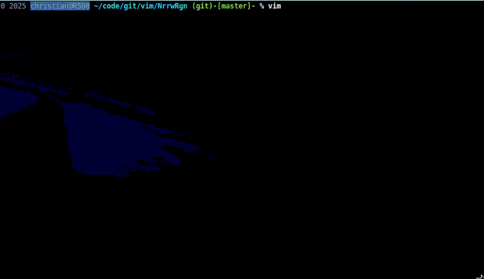

# NrrwRgn plugin
> A Vim plugin for focussing on a selected region

This plugin is inspired by the [Narrowing feature of Emacs](http://www.emacswiki.org/emacs/Narrowing) and means to focus on a selected region while making the rest inaccessible. You simply select the region, call `:NR` and the selected part will open in a new split window while the rest of the buffer will be protected. Once you are finished, simply write the narrowed window (`:w`) and all the changes will be moved back to the original buffer.

See also the following screencast, that shows several features available:

### Installation
Use the plugin manager of your choice. Or download the [stable][] version of the plugin, edit it with Vim (`vim NrrwRgn-XXX.vmb`) and simply source it (`:so %`). Restart and take a look at the help (`:h NrrwRgn.txt`)

[stable]: http://www.vim.org/scripts/script.php?script_id=3075

### Usage
Once installed, take a look at the help at `:h NrrwRgn`

Here is a short overview of the functionality provided by the plugin:
#### Ex commands:
    :NR		 - Open the selected region in a new narrowed window
    :NW		 - Open the current visual window in a new narrowed window
    :WidenRegion - (In the narrowed window) write the changes back to the original buffer.
    :NRV	 - Open the narrowed window for the region that was last visually selected.
    :NUD	 - (In a unified diff) open the selected diff in 2 Narrowed windows
    :NRP	 - Mark a region for a Multi narrowed window
    :NRM	 - Create a new Multi narrowed window (after :NRP)
    :NRS	 - Enable Syncing the buffer content back (default on)
    :NRN	 - Disable Syncing the buffer content back
    :NRL	 - Reselect the last selected region and open it again in a narrowed window
#### Visual mode commands:
    <Leader>nr		 - Open the current visual selection in a new narrowed window
#### Scripting Functions:
    nrrwrgn#NrrwRgnStatus()   - Return a dict with all the status information for the current window

### Attention
   :NRM is currently experimental

#### Similar Work
Andreas Politz' [narrow_region](http://www.vim.org/scripts/script.php?script_id=2038) 
Kana Natsunos [narrow](http://www.vim.org/scripts/script.php?script_id=2097) 
Jonas Kramers [narrow](http://www.vim.org/scripts/script.php?script_id=2446) 
Marcin Szamotulskis [ViewPort](http://www.vim.org/scripts/script.php?script_id=4296) 

### License & Copyright

© 2009-2014 by Christian Brabandt. The Vim License applies. See `:h license`

__NO WARRANTY, EXPRESS OR IMPLIED.  USE AT-YOUR-OWN-RISK__
